# Field Tools

**Eleven small, free tools that answer the homelab questions a guide can't** — because the answer depends on *your* hardware, *your* data, and *your* dependencies.

[](LICENSE)
[](https://github.com/peiralabs/field-tools/actions/workflows/check.yml)
[](#the-eleven-tools)
[](#how-this-repo-is-built)

**Use them now → [peira.dev/tools](https://peira.dev/tools/)** · no signup, no tracking, no account.

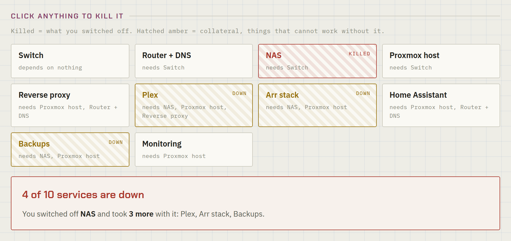

---

## Why these exist

Every homelab guide ends in the same handful of questions. *How much hardware do I actually need? What happens when one box dies? Are my backups real or just a feeling? Why can't this container reach that one?*

A guide can walk you through a setup. It can't do arithmetic about your particular lab. So these do.

They are deliberately **not** another set of calculators. The internet already has thirty RAID capacity calculators and a dozen subnet tools, and they are all fine. What barely exists is tooling that encodes **sequence, consequence, and judgment** — what order to shut things down in, what else breaks when this breaks, whether the command you just pasted can be undone. That's the gap these aim at.

Seven of the eleven are a single HTML file with no build step, no framework, and no network calls once the page has loaded. Four need a language model to do their job, so they run inside [Claude](https://www.anthropic.com/claude) on *your* account — which means they cost me nothing to offer and can stay free indefinitely.

---

## Quick start

**Three ways to use them, in increasing order of commitment:**

**1. Just use them.** Open [peira.dev/tools](https://peira.dev/tools/). Nothing to install.

**2. Run them locally.** Every non-AI tool is one self-contained file. Clone and open it — no server needed:

```bash
git clone https://github.com/peiralabs/field-tools.git
cd field-tools
xdg-open blast-radius.html    # macOS: open · Windows: start
```

That's the whole install. Save the file to a USB stick and it still works on a machine with no internet.

**3. Fork and change one.** Every tool is also published as a public, remixable Claude artifact — open one, hit remix, and edit it in the browser. Links in [the table below](#the-eleven-tools). Or edit the HTML here and send a pull request; see [CONTRIBUTING.md](CONTRIBUTING.md).

---

## The eleven tools

Grouped by the moment you'd reach for them.

| | Tool | What it answers | Remix |
|---|---|---|---|
| **FT-01** | [Sizing Calculator](sizing-calculator.html) | How much hardware do I need for the services I want? | [artifact](https://claude.ai/public/artifacts/2819e14f-a8c4-45b7-84fd-2ebfa508eb4c) |
| **FT-02** | [Node Failure Simulator](node-failure-simulator.html) | If a node dies tonight, what actually fits on the survivors? | [artifact](https://claude.ai/public/artifacts/617816e4-dbe1-499a-99a6-85cc7df269a9) |
| **FT-03** | [3-2-1 Backup Planner](backup-tier-planner.html) | Which of my data would a single failure actually destroy? | [artifact](https://claude.ai/public/artifacts/82a29c54-a7e8-4c3d-9b29-ec986cb46905) |
| **FT-04** | [Overlay Network Diagnostic](overlay-network-diagnostic.html) | Why can't this container reach that box across my tailnet? | [artifact](https://claude.ai/public/artifacts/e73f2b04-e238-4e82-8f52-7b9fa35842ed) |
| **FT-05** | [Homelab Troubleshooter](homelab-troubleshooter-ai.html) 🤖 | What are the likely causes, in the order I should check them? | [artifact](https://claude.ai/public/artifacts/aa503b55-3fc7-4da2-997b-10922d912c5a) |
| **FT-06** | [Log Triage](log-triage.html) 🤖 | Which line in this wall of output is the actual cause? | [artifact](https://claude.ai/public/artifacts/9dedd019-780b-4879-a70e-80ed5eac81da) |
| **FT-07** | [Compose Review](compose-review.html) 🤖 | What in this stack will bite me on the next update or reboot? | [artifact](https://claude.ai/public/artifacts/d5f1c723-f9eb-49d0-91bc-0b03e4a94226) |
| **FT-08** | [Explain Before You Run](explain-command.html) 🤖 | What does this command touch, and can I undo it? | [artifact](https://claude.ai/public/artifacts/2d8c8530-a672-4c28-bf38-5b945bce143b) |
| **FT-09** | [Power-Loss Playbook](power-loss-playbook.html) | What order do things shut down in, and does that fit the battery? | [artifact](https://claude.ai/public/artifacts/5454d01d-aa01-4a38-8839-b45059a7375e) |
| **FT-10** | [Blast Radius Mapper](blast-radius.html) | What *else* stops when this stops? | [artifact](https://claude.ai/public/artifacts/5ab90394-1abf-4a1b-a7fd-f0c5d17f8920) |
| **FT-11** | [Bus Factor](bus-factor.html) | Could anyone else recover this if I weren't here? | [artifact](https://claude.ai/public/artifacts/9104b77b-75fa-4f26-8fa6-d30a26ba3c1e) |

🤖 = needs a Claude account, because it needs a model. The other seven need nothing.

### Plan the build

<details open>
<summary><b>FT-01 · Sizing Calculator</b> — tick your services, get honest numbers</summary>

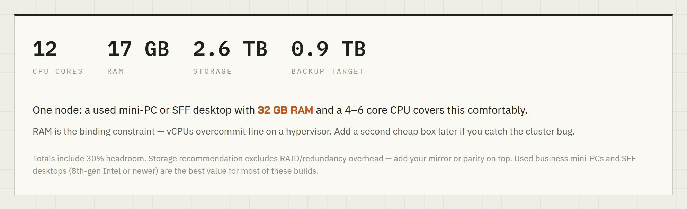

Pick what you want to run and it works out cores, RAM, storage and a backup target, with 30% headroom baked in. The number it cares most about is **RAM**, because that's the constraint that actually binds — vCPUs overcommit happily on a hypervisor, memory doesn't.

Tick *survive one node failure* and the shape of the answer changes: you get a minimum of three nodes. [Proxmox's cluster documentation](https://pve.proxmox.com/wiki/Cluster_Manager) is direct about why — *"if you are interested in High Availability, you need to have at least three nodes for reliable quorum"* — because a cluster that loses quorum switches to read-only, and two nodes have no majority left after one dies. The documented escape hatch is a **QDevice**, an external third vote that lets a 2-node cluster keep quorum; this tool doesn't model one, so treat its 3-node floor as the no-QDevice answer.
</details>

<details>
<summary><b>FT-02 · Node Failure Simulator</b> — kill a node, watch what lands where</summary>

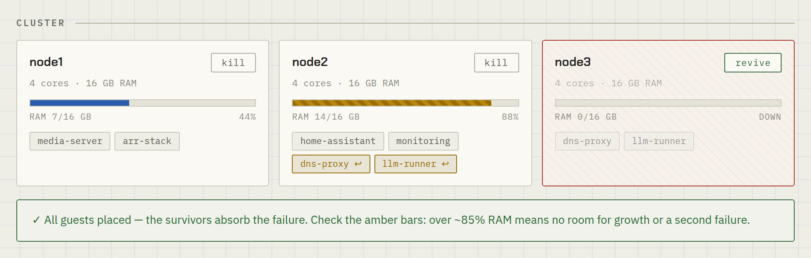

Model your cluster, click **kill**, and see which guests fit on the survivors. Placement is a greedy fit: critical guests place first, RAM is the hard constraint, CPU allows 2× overcommit. Re-homed guests are marked `↩`.

The useful output is the amber bar. A survivor at 88% RAM "worked", but it has no room for growth or a second failure. **This is a model, not your cluster** — real HA also needs shared or replicated storage, and a guest whose disk died with its node isn't migrating anywhere.
</details>

<details>
<summary><b>FT-03 · 3-2-1 Backup Planner</b> — find the gap before a dead disk does</summary>

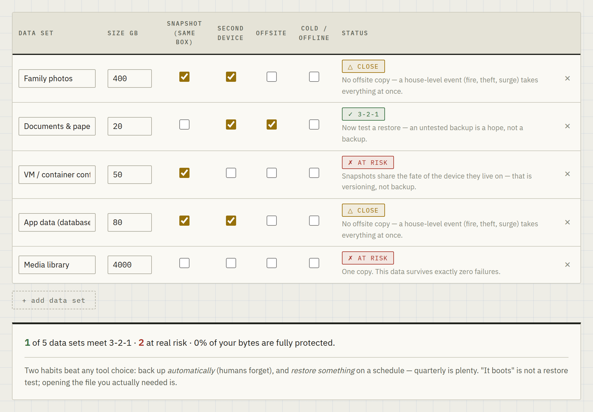

List what you'd hate to lose, tick where copies live, and it tells you which failure each data set can't survive yet. The rule it checks — three copies, two devices, one offsite — is the one [CISA recommends](https://www.cisa.gov/audiences/small-and-medium-businesses/secure-your-business/back-up-business-data) for small organisations.

It is blunt about one thing in particular: **a snapshot on the same disk as the original is versioning, not a backup.** It shares the fate of the device it lives on.
</details>

### Fix what's broken

<details>
<summary><b>FT-04 · Overlay Network Diagnostic</b> — the three layers that fail silently</summary>

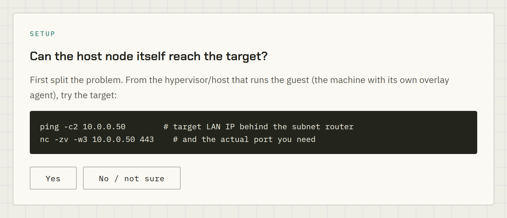

"My container can't reach a machine across my [Tailscale](https://tailscale.com) subnet router, but other machines can." Three separate layers have to be right, and **two of them fail with no log and no rejection** — the connection simply times out.

This walks them in order: the route inside the guest, the ACL grant (a subnet-routed source is *not* a tailnet member, so a grant for `autogroup:member` doesn't cover it), and a firewall on the destination. Built from one genuinely miserable afternoon.
</details>

<details>
<summary><b>FT-05 · Homelab Troubleshooter</b> 🤖 — ranked causes, not a lecture</summary>

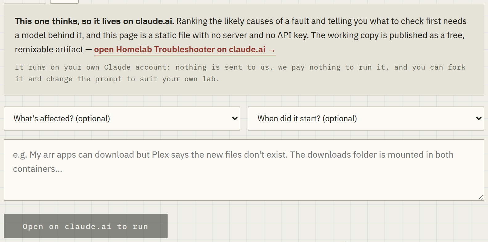

Describe what's broken; get ranked likely causes, the exact commands to check them, and the probable fix — in the order an experienced homelabber would actually try them, boring causes first.

The screenshot shows what the **self-hosted copy** looks like: it detects that there's no model available and points at the artifact instead of failing. That's the honest fallback, not a bug.
</details>

<details>
<summary><b>FT-06 · Log Triage</b> 🤖 — the one line that matters</summary>

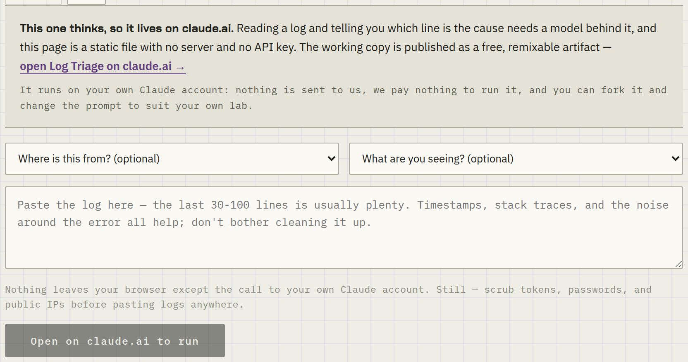

Paste the wall of output. Get the line that is actually the cause, what it means in plain English, **which of the scary-looking lines you can safely ignore**, and the next command to run.

That third one is the part people underestimate. Most of what looks alarming in a boot log is routine.
</details>

<details>
<summary><b>FT-07 · Compose Review</b> 🤖 — not a YAML linter</summary>

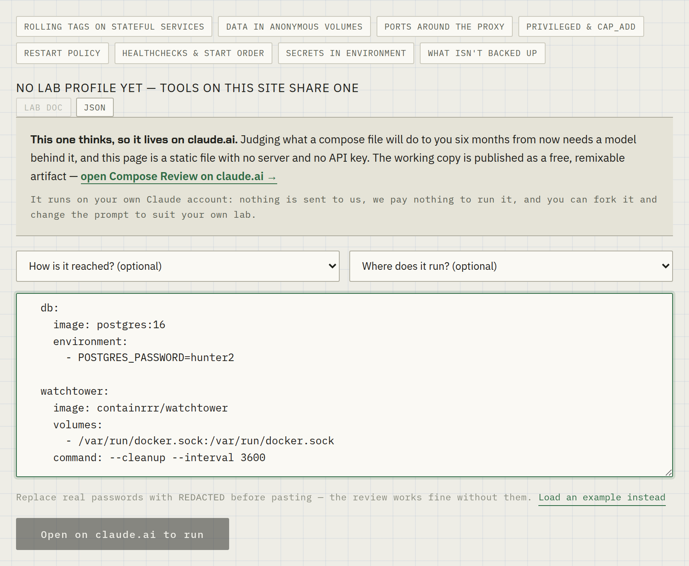

Your file already parses. This reads a `docker-compose.yml` for **operational consequence**: rolling tags on stateful services, data sitting in anonymous volumes, ports that bypass your reverse proxy, `depends_on` without a condition, the Docker socket mounted into a container.

It is careful about a fact that half the internet gets wrong. Since Docker 23.0, [`docker volume prune`](https://docs.docker.com/reference/cli/docker/volume/prune/) removes **only anonymous volumes** — named volumes need `--all`. The command that really does delete named volumes is [`docker compose down -v`](https://docs.docker.com/reference/cli/docker/compose/down/), which removes those declared in that file's `volumes:` section.
</details>

<details>
<summary><b>FT-08 · Explain Before You Run</b> 🤖 — a second opinion, not a permission slip</summary>

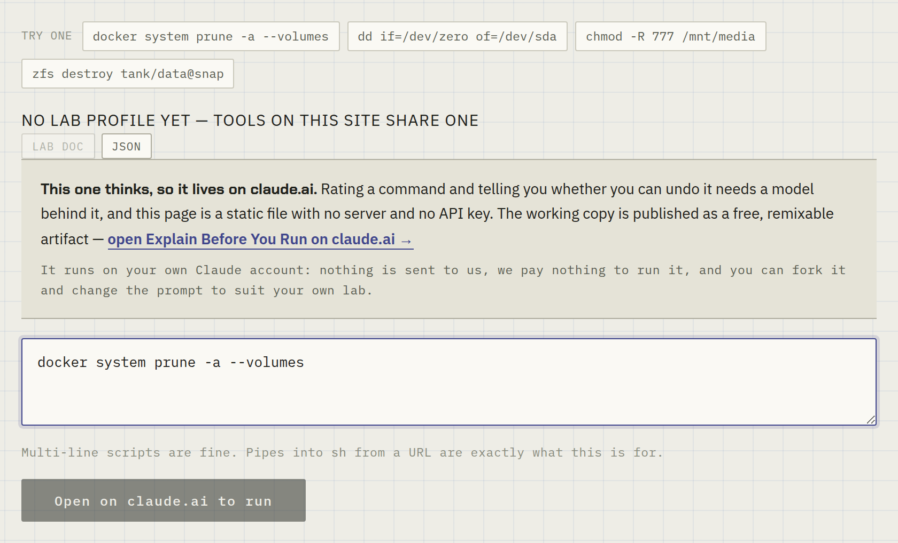

Paste that command you found in a forum reply. Get a plain-English breakdown, a red/amber/green rating, exactly what it touches, and an honest answer on whether you can undo it — plus a safer version where one exists.

It's built to avoid crying wolf. Inflating the risk on safe commands trains people to ignore you, so green really means green.
</details>

### Survive the bad day

<details>
<summary><b>FT-09 · Power-Loss Playbook</b> — does your shutdown fit in the battery?</summary>

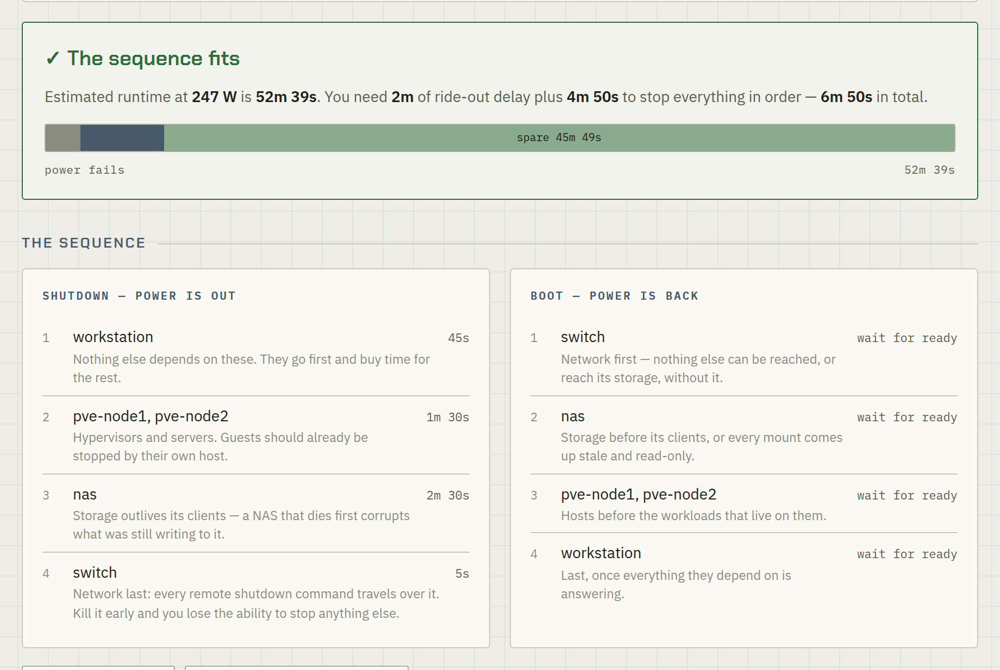

Runtime calculators tell you how many minutes you have. None of the ones I could find tell you the part that matters: **what order to shut things down in, and whether that sequence fits inside the time you've got.**

It orders machines into waves — workloads first, then compute, then storage, and the network **last**, because every remote shutdown command travels over it — then checks the total against your battery with an honest allowance for age. It prints as a card for the rack, and will generate matching [NUT](https://networkupstools.org/) settings.

The runtime figure is arithmetic, not a measurement. The only honest test is pulling the plug on purpose while you're standing there.
</details>

<details>
<summary><b>FT-10 · Blast Radius Mapper</b> — what else dies with it</summary>


Everyone knows what their services do. Far fewer know what *else* stops when one dies. Map the dependencies, click something to kill it, watch the cascade.

The ranking underneath is the real payoff: it scores every service by how much it takes down with it. The winner is usually an unglamorous box — the switch, DNS, the host your containers actually run on — rather than the service you'd have guessed.
</details>

<details>
<summary><b>FT-11 · Bus Factor</b> — could anyone else recover this?</summary>

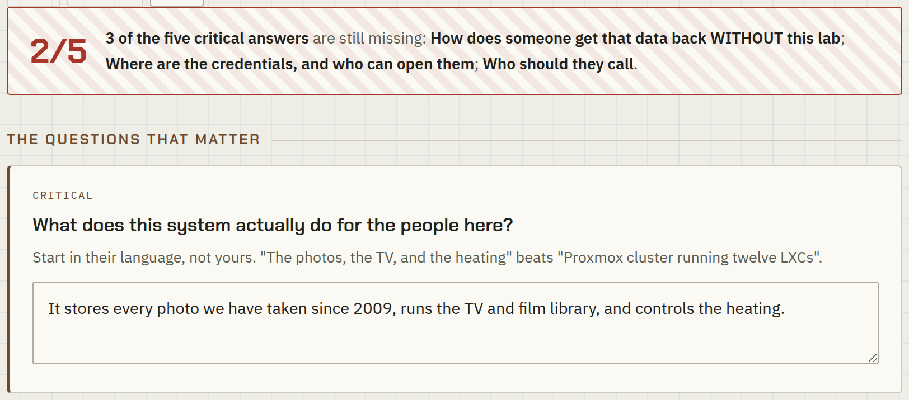

If you were unavailable for a month — or permanently — could the people you live with get their photos back, keep the heating on, and know what's safe to switch off? Nine questions, and it hands you a letter written for someone who has never used a terminal.

**It never asks for a password.** It asks *where the credentials are* and who is allowed to open them, which is the version of that answer that's safe to print and put in a drawer. And it is deliberately unflinching about the question most of us can't answer: how does someone get the data back **without** the lab?
</details>

---

## One lab, described once

This is the part that makes them a set rather than eleven unrelated pages.

Describe your lab once — tick services in the sizing calculator, press **Save to profile** — and the others pick it up. The failure simulator opens with your nodes and workloads modelled. The backup planner knows what data you have. The power-loss playbook knows what's plugged in. The AI tools quietly use it as context, so answers are about *your* lab rather than a generic one.

```
FT-01  ──save──▶  lab profile  ──▶  FT-02 nodes + guests, ready
                  (your browser)  ──▶  FT-03 data sets listed
                                  ──▶  FT-09 machines to shut down
                                  ──▶  FT-05..08 as prompt context
```

**Lab doc** exports the whole thing as a Markdown record for your own notes.

It lives in `localStorage` on one origin and goes nowhere near a server — which is also why it doesn't follow you between devices. The JSON export is how you move it. If storage is unavailable the profile degrades to in-memory for the session rather than breaking.

---

## Privacy, honestly stated

- **No accounts, no cookies, no analytics** on any tool page.
- **The seven offline tools make no network calls at all** once loaded — all arithmetic happens in the page, and anything you save stays in your browser.
- **The four AI tools** send what you type to **your own Claude account** via the in-artifact API. Nothing reaches me. I never see any of it, and I pay nothing to run them — which is precisely why they can stay free.
- **One third-party request exists** and it would be dishonest not to name it: the pages load their typeface from Google Fonts. That's it. If that bothers you, self-host the two font families and delete the `<link>`.
- **Every address shipped here is a non-routable example** — `10.0.0.x` from the [RFC 1918](https://datatracker.ietf.org/doc/html/rfc1918) private range, plus the [RFC 6598](https://datatracker.ietf.org/doc/html/rfc6598) shared-address range base `100.64.0.0` where a tool needs to talk about CGNAT. Hostnames are placeholders. **No real network is described anywhere in this repo**, and the gate fails the build if an address outside those ranges appears.

Still: **scrub tokens, passwords and public IPs before pasting logs or configs into anything**, including these.

---

## How this repo is built

There is no build step and no framework. Each tool is one file you can open with `file://`.

That constraint is deliberate and it's the interesting engineering problem here: **a published Claude artifact cannot reference an external script**, so shared code can't be imported — it has to be *stamped in*.

```
field-tools/
├── <tool>.html              11 self-contained tools — never edit the injected blocks
├── _shared/
│   ├── profile.{js,css}     the lab profile: storage, the bar, Markdown export
│   └── ai.{js,css}          the AI shell: markdown renderer, conversation runner,
│                            and the guard that degrades gracefully off claude.ai
├── scripts/
│   └── capture-screenshots.mjs   regenerates docs/screenshots
├── inject-profile.mjs       stamps _shared/ into every tool between markers
├── check-tools.mjs          the gate (see below)
├── sync-to-blog.mjs         copies the tools into the site that serves them
└── docs/screenshots/        README images, reproducible via the script above
```

**Edit `_shared/`, never the copy inside a tool.** The injector rewrites everything between `<!-- PROFILE:JS -->` / `<!-- /PROFILE:JS -->` style markers in all eleven files.

```bash
node inject-profile.mjs          # after any _shared/ change
node inject-profile.mjs --check  # verify nothing is stale (CI runs this)
node check-tools.mjs             # the gate
```

### The gate

`check-tools.mjs` enforces the things that have actually gone wrong, not a generic lint list:

| Check | Why it exists |
|---|---|
| Every `<script>` parses | Obvious, but cheap insurance across eleven files |
| **No raw control characters** | A literal control byte used as a sentinel survived every local test, then got silently stripped by a clipboard and broke a published tool. Use `\xNN` escapes. |
| No unfilled `ARTIFACT_URL` | A placeholder shipping to production is a dead link |
| Addresses stay in documentation ranges | The publication-safety rule above, enforced rather than remembered |
| Shared layer is freshly injected | Catches "edited `_shared/` and forgot to run the injector" |

CI runs it on every push and pull request.

---

## Design notes

The tools look like a printed field manual — putty paper, a faint drafting-blue grid, hairline rules, diagonal hatching for warning states, one desaturated ink per tool. That's a deliberate choice, arrived at after two iterations that looked like everything else.

The first draft was dark-mode with neon accents and glowing cards. It looked competent and completely generic. The look here was chosen by working *away* from the patterns that have become visual shorthand for machine-generated design — dark-plus-glow, one-sided accent borders on cards, tracked-caps kicker labels above headings, cream-and-terracotta palettes. What replaced them: hairlines instead of soft shadows, near-square corners, restraint with colour, and motion **only** on state change rather than ambient animation.

You may disagree with the result. The point is that it was a decision rather than a default.

---

## Contributing

Genuinely welcome — especially new tools that answer a question the internet currently doesn't. Start with [CONTRIBUTING.md](CONTRIBUTING.md); it covers the single-file rule, the design system, and what the gate will reject.

Found a bug or a wrong technical claim? **Wrong claims are the most valuable bug reports here**, because these tools state facts to people with no byline to check. [Open an issue.](https://github.com/peiralabs/field-tools/issues/new/choose)

## Security

The tools are static files with no server, no API key and no user accounts, so the attack surface is small — but not zero. See [SECURITY.md](SECURITY.md) for the threat model and how to report something privately.

## Licence

[MIT](LICENSE) — use, modify, redistribute, commercially or otherwise. Attribution is appreciated but only the copyright notice is required.

---

Built for [peira.dev](https://peira.dev), where the guides these came out of live. If one of these is nearly right for your lab but not quite, take it and change it — that is genuinely the point.
